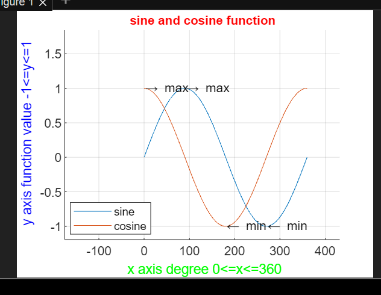

This repository contains implementations of several numerical methods commonly used in scientific computing. These methods have been implemented in Matlab and are organized into several folder based on the type of problem they are designed to solve.

The following numerical methods are currently included in this repository:

Root finding methods:

Bisection method
 
Newton's raphson  method
 

Ordinary differential equation (ODE) solvers:

Euler's method
 
Runge-Kutta methods (2nd and 4th order)

Each folder  contains a separate MATLAB script or function with the same name as the numerical method it implements.

To use the code in this repository, simply download or clone the repository to your local machine and run the desired script or function in MATLAB. Each script or function can be run by calling its name in the MATLAB command window.

To use the code in this repository, simply download or clone the repository to your local machine and run the desired script or function in MATLAB. Each script or function can be run by calling its name in the MATLAB command window.
 
Once you have run a script or function, you can modify its input parameters or variables to solve different numerical problems.

Thank you for using our numerical methods code repository in MATLAB!
